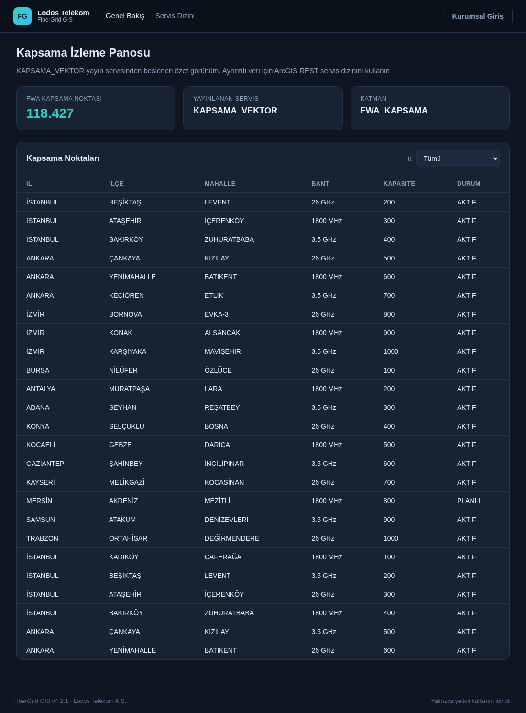
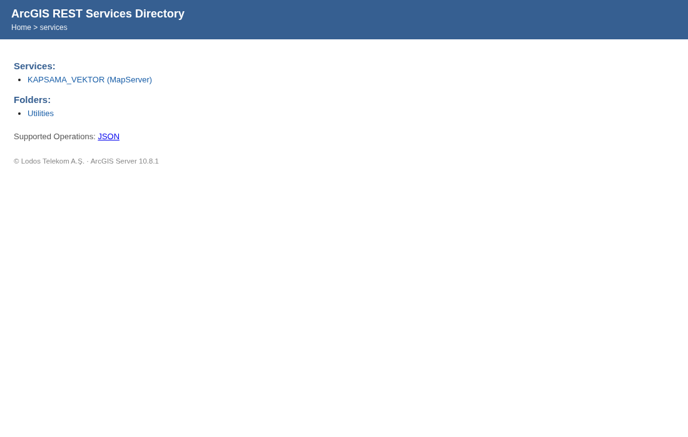
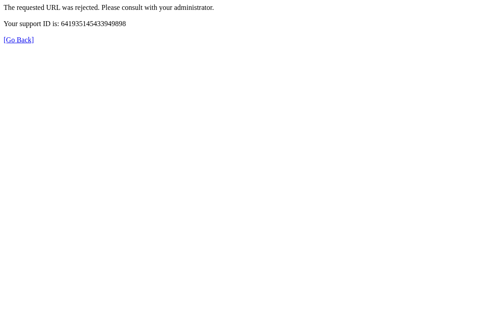

# FiberGrid CTF — ArcGIS-style MapServer blind SQLi with WAF bypass

A single-host, Docker-based lab that recreates the full lifecycle of a
real-world web engagement: an unauthenticated GIS query interface, an
F5 ASM-style WAF in front of it, and an Oracle-compatible database that
holds both published and unpublished planning data.

The lab is a fictional reconstruction. The company, the data and the
identifiers are synthetic; the attack surface and the payload semantics follow
the original finding (a real, authorized HackerOne engagement) so the
documented techniques can be replayed end to end.

## Scenario

You are assessing the public surface of **Lodos Telekom**, a regional fiber
operator. Their internal GIS platform, **FiberGrid**, publishes an FWA coverage
layer through an ArcGIS-style REST API under `/arcgis/rest/services`. The
query endpoint is unauthenticated and accepts a `where` clause that reaches the
database as native SQL. A WAF rejects the obvious payloads.

Objectives:

1. confirm the injection and build a boolean oracle,
2. map the WAF and find the arithmetic that survives it,
3. read the Oracle dictionary and locate the unpublished tables,
4. extract hidden records with character-by-character extraction,
5. chain the extracted export name into the unauthenticated download endpoint.

## Flags

There are **4 flags**, all in `FLAG{...}` format:

| # | Stage | Obtained from |
|---|-------|---------------|
| 1 | Recon | internal address data exposed by the portal API |
| 2 | Blind SQLi | unpublished staging table `A90312` |
| 3 | Blind SQLi | targeted route record in `GUZERGAH` |
| 4 | Chain | archive served by the unauthenticated export endpoint |

Flag values are visible in this repository; the point of the lab is the path,
not the secret. If you publish a write-up, keep the process inside a spoiler
section.

## Difficulty

Hard. The WAF blocks `AND`, `OR`, comments, `COUNT(*)`, leading subqueries and
comparison operators, so `sqlmap` reports the endpoint as *not injectable*.
Expect 2–4 hours for a first manual solve.

## Quick start

Requirements: Docker with Compose v2, ~2 GB RAM, ~1 GB disk.

```bash
git clone <your-fork-url> fibergrid-ctf
cd fibergrid-ctf
docker compose up -d --build
```

The first boot seeds roughly 860K rows. Wait until `docker compose ps` reports
every service as healthy (30–60 seconds on a laptop), then open:

- Portal:     <http://localhost:8080/>
- REST index: <http://localhost:8080/arcgis/rest/services?f=json>

Only the WAF port is published, and it is bound to `127.0.0.1` on purpose.

## Screens

| Portal | ArcGIS REST directory | WAF rejection |
|---|---|---|
|  |  |  |

## Architecture

```
                 ┌────────────────────────────────────────────┐
   attacker ───▶ │  waf   F5 ASM-style value inspection       │ :8080
                 │        blocks AND/OR/comments/COUNT()/...  │
                 └───────────────────────┬────────────────────┘
                                         │ dmz network
                 ┌───────────────────────▼────────────────────┐
                 │  app   Flask                               │ :8000
                 │        /arcgis/rest/services/...           │
                 │        /webservice/api/...                 │
                 │        /            (GIS portal)           │
                 └───────────────────────┬────────────────────┘
                                         │ internal network
                 ┌───────────────────────▼────────────────────┐
                 │  db    PostgreSQL 16 + Oracle compat layer │ :5432
                 │        sde.fwa_nokta_verisi (published)    │
                 │        cbs.guzergah, cbs.a90312 (internal) │
                 │        cbs.tab / col / all_users / ...     │
                 └────────────────────────────────────────────┘
```

The database is PostgreSQL running as the quoted role `"CBS"` with an
Oracle-compatibility layer: `DECODE`, `NVL`, `SYS_GUID()` and the dictionary
views `TAB`, `COL`, `ALL_USERS`, `DATABASE_PROPERTIES`. Text columns use the
`C` collation so `MIN`/`MAX`/`GREATEST` ordering matches Oracle's binary sort.
See `docs/ARCHITECTURE.md` for the fidelity notes.

## Target surface

| Path | Description |
|------|-------------|
| `/` | FiberGrid GIS portal (province data loads from the portal API) |
| `/arcgis/rest/services?f=json` | service directory — only `KAPSAMA_VEKTOR` is published |
| `/arcgis/rest/services/KAPSAMA_VEKTOR/MapServer/0/query` | layer query interface (the injection point) |
| `/arcgis3d/rest/...` | 3D service root — redirects to the login page |
| `/webservice/api/AddressData/Iller` | province list with internal notes |
| `/webservice/api/FTTH_ENVANTER/export` | queues an export job (no authentication) |
| `/webservice/api/Export?file=<name>` | serves generated archives (no authentication) |

## The WAF profile

Blocked by value inspection (case-insensitive, percent-decoded, applied to
parameters):

- boolean/set keywords: `AND`, `OR`, `LIKE`, `ILIKE`, `SIMILAR`, `REGEXP*`,
  `UNION`, `EXEC`, `WAITFOR`, `EXISTS`, `BETWEEN`
- aggregation and shape: `COUNT(`, leading `(SELECT`, leading `SELECT`
- string/position helpers: `ASCII(`, `SUBSTR(`, `SUBSTRING`, `INSTR(`,
  `TRANSLATE(`, `POSITION`, `STRPOS`, `STARTS_WITH`, `SPLIT_PART`, `LEFT(`,
  `RIGHT(`, `LPAD(`, `RPAD(`, `OVERLAY`, `REPLACE(`, `TRIM(`/`LTRIM(`/
  `RTRIM(`/`BTRIM(`
- row limiting and PostgreSQL-only operators: `LIMIT`, `FETCH`, `OFFSET`,
  `^@`, `@@`, `to_tsvector`, `to_tsquery`
- dictionary/fingerprinting: `ALL_TABLES`, `ALL_OBJECTS`, `GLOBAL_NAME`,
  `SYS_CONTEXT`, `ORA_DATABASE_NAME`, `ROWNUM`, `V$DATABASE`,
  `information_schema`, `pg_*`, `current_database(`, `version(`
- time-based/OOB: `SLEEP(`, `BENCHMARK(`, `DBMS_*`, `UTL_*`
- comments, separators, comparison and pattern operators: `--`, `/*`, `#`,
  `;`, `<`, `>`, `~`, backslash

Everything else reaches the database — including `DECODE`, `SIGN`,
`GREATEST`, `NVL`, `MIN`, `MAX`, `LENGTH`, equality-based subqueries and
`IN (...)` tuples.

## Hints and solution

- `HINTS.md` — five progressive hint levels, each hidden behind a spoiler tag.
- `solve/WRITEUP.md` — full walkthrough with the payloads and the extraction
  algorithm (**major spoiler**).
- `solve/solve.py` — reference solver; extracts all four flags end to end.
- `tests/smoke.sh` — verifies the lab behaves as intended.

## Operations

```bash
make up       # build and start
make ps       # service status
make logs     # follow logs
make test     # smoke tests
make solve    # run the reference solver (SPOILER)
make reset    # stop and wipe the database volume
make debug    # expose app:8000 and db:5432 for lab maintenance
```

CI (`.github/workflows/lab-ci.yml`) builds the stack from scratch, runs the
smoke tests and executes the reference solver on every push.

## Troubleshooting

- **Port 8080 busy** — set `LAB_PORT` in `.env` and recreate the stack.
- **Database never becomes healthy** — check `docker compose logs db`. On very
  slow disks the seed can take a couple of minutes on first boot.
- **WAF responds but the app does not** — `docker compose logs app`;
  the app waits for the database healthcheck before starting.
- **Reset everything** — `make reset && make up` regenerates the data set
  deterministically.

## Disclaimer

This lab is intentionally vulnerable and is meant to run on your own machine.
Do not expose it to the internet. The scenario, company and data are fictional;
any resemblance to production systems is coincidental. Techniques demonstrated
here must only be used against systems you are authorized to test.

## License

MIT — see `LICENSE`.
